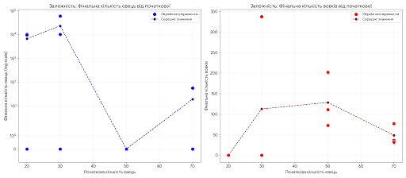
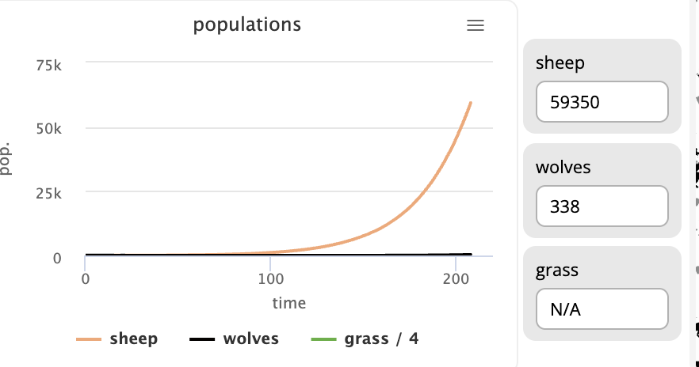
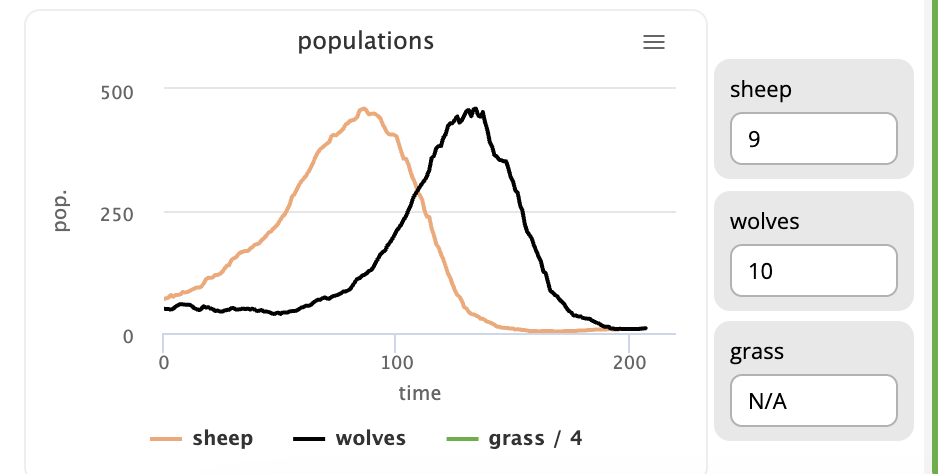
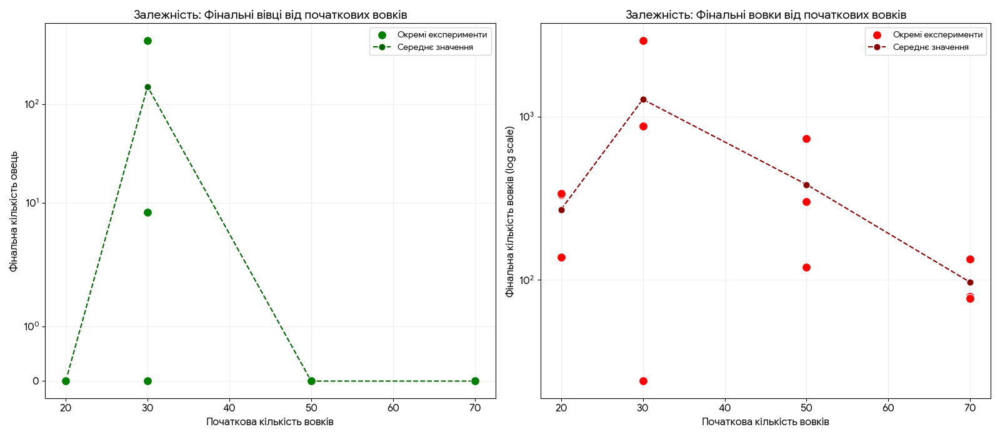

# Комп'ютерні системи імітаційного моделювання
## Лабораторна робота №1. Опис імітаційних моделей та проведення обчислювальних експериментів

# СПм-24-3 Череповський Марк Андрійович 
 

Модель [Wolf Sheep Predation](https://www.netlogoweb.org/launch#http://www.netlogoweb.org/assets/modelslib/Sample%20Models/Biology/Wolf%20Sheep%20Predation.nlogo)
 

### 1.1 Мета роботи
Ознайомитись з готовими моделями з різних предметних областей реального світу, які пропонуються середовищем мультиагентного імітаційного моделювання NetLogo.  
Навчитися описувати модель та проводити обчислювальні експерименти для дослідження її роботи.

 

# Вербальний опис моделі

Ця модель досліджує стабільність екосистем «хижак-жертва». Така система називається нестабільною, якщо вона призводить до вимирання одного або декількох видів, що входять до її складу. Навпаки, система є стабільною, якщо вона має тенденцію до самовідновлення з часом, незважаючи на коливання чисельності популяції.

Ця модель має кілька варіантів, sheep-wolves та sheep-wolves-grass. Перша модель припускаєж що вівці завжди мають достатньо енергії та їжі для існування, коли друга модель у свою чергу враховує те, скільки трави їдять вівці, та на основі цього ми бачему більш детальну картину. 

# Керуючі параметри
До керуючи парметрів можно віднести наступні
- INITIAL-NUMBER-WOLVES цей парметр відповідає за первоначальне налаштування кількості вовків
- INITIAL-NUMBER-SHEEP так само відповідає за початкове налаштування кількості агентів(вівць)
- SHEEP-GAIN-FROM-FOOD кількість енергії яку отримаж вівця від поїдання трави
- WOLF-GAIN-FROM-FOOD кількість енергії яку отримую вовк від поїдання вівці 
- WOLF-REPRODUCE відповідає за вірогідність размноження вовка на кожному кроці сімуляції
- SHEEP-REPRODUCE відповідає за вірогідність размноження вівці за один крок сімуляції 

- RASS-REGROWTH-TIME вказує на час необхідний для взрощення трави(враховується лишу у режимі sheep-wolves-grass)

- SHOW-ENERGY має лише два значення що відповідають за створення візуального відображення енергії кожного агента 
  
# Внутрішні параметри
До внутрішніх парметрів можна віднести наступне 
- amount-of-wolves - цей показник вказує на кількість агентів вовк на кожному кроці сімуляції 
- amount-of-sheaps - цей параметр вказує на кількість агаентів вівця на кожному кроці сімуляції 
- energy - параметр що вказує на кількість енергії кожного агента. У режимі sheep-wolves параметр енергії вовка зменшуєтсья на однин за кожен крок, тоді як у вівці він завжди дорівнює 100.  У другому режимі сімуліції sheep-wolves-grass, значення енергії зменшуєтсьяна один для кожного з агентів якщо той не поїв на цьому кроці.

# Показники системи

Система має три показники роботи, а саме: кількість овець, кількість вовків та кількість трави. Ці три параметри безпосередньо впливають один на одного.

# Недоліки системи

До недоліків моделі можна віднести кілька моментів, таких як:

1)  модель не враховує швидкість зростання трави;
2)  модель не враховує інші типи тварин, які теж їдять траву та яких вовки теж можуть їсти;
3)  модель також не враховує пору року, від якої залежить час та ймовірність зростання трави.

Але якщо враховувати ці обмеження, то дана модель чудово ілюструє процес біологічних харчових ланцюгів.

# Обчислювальні експерименти

Для простоти аналізу розділю дослідження на кілька частин: спочатку протестую, як змінюються метрики базової моделі (де вівці завжди мають джерело харчування), а другим етапом розгляну, як змінюються показники моделі під час нестачі їжі для овець.

Всі дослідження триватимуть 200 кроків, за умови, що симуляція не закінчиться раніше. Також кожне дослідження буде проведено 3 рази, а для подальшого аналізу результатів буде використане середнє значення. Це допоможе побачити більш глибоку картину того, що відбувається.

### Частина перша

#### 1) Дослідження впливу початкової кількості овець

Досліджується залежність кількості вовків та овець від збільшення початкової кількості овець. Кількість вовків у цьому дослідженні залишається статичною та дорівнює 50. Ймовірність розмноження вівці та вовка дорівнює 4 та 5 відсотків відповідно. Кількість енергії, яку отримує вовк у цьому дослідженні, теж дорівнює константі, а саме 20.

**Результати експериментів**

| Номер експерименту | Початкова кількість овець | Фінальна кількість овець | Фінальна кількість вовків |
| :---: | :---: | :---: | :---: |
| 1 | 20 | 10338 | 0 |
| 2 | 20 | 9800 | 0 |
| 3 | 20 | 0 | 0 |
| 4 | 30 | 0 | 0 |
| 5 | 30 | 59350 | 338 |
| 6 | 30 | 10241 | 0 |
| 7 | 50 | 0 | 111 |
| 8 | 50 | 0 | 202 |
| 9 | 50 | 0 | 73 |
| 10 | 70 | 0 | 37 |
| 11 | 70 | 57 | 32 |
| 12 | 70 | 0 | 77 |

Графік результатів першого дослідження

Як можна побачити з таблиці дослідження, ця модель не має прямої залежності результату від початкових параметрів кількості овець, але можна виокремити 2 патерни, які зображені на рисунках 2 та 3.

Паттерн коли вівці перемогають

Паттерн коли всі померають

З цього дослідження можемо зробити висновок: якщо вівці помирають, вовки з часом теж гинуть.

#### 2) Дослідження впливу початкової кількості овець

У цьому експерименті досліджується залежність кількості вовків та овець від збільшення початкової популяції хижаків. Початкова кількість овець є фіксованою і дорівнює 50. Інші параметри системи (ймовірність розмноження, енергія від їжі тощо) залишаються незмінними та відповідають налаштуванням першого дослідження.

### Результати експерименту: Вплив початкової кількості вовків

| Номер експерименту | Початкова кількість вовків | Фінальна кількість вівць | Фінальна кількість вовків |
| :---: | :---: | :---: | :---: |
| 1 | 20 | 0 | 332 |
| 2 | 20 | 0 | 138 |
| 3 | 20 | 0 | 339 |
| 4 | 30 | 8 | 24 |
| 5 | 30 | 44529 | 24 |
| 6 | 30 | 0 | 871 |
| 7 | 50 | 0 | 120 |
| 8 | 50 | 0 | 729 |
| 9 | 50 | 0 | 301 |
| 10 | 70 | 0 | 79 |
| 11 | 70 | 0 | 134 |
| 12 | 70 | 0 | 77 |

Результати дослідження 

З цього та попередньго дослідження можемо зробити висновки що при збільшенні кількості овець до 30+ майже гарантовано приводить до ситуації повного знищення овець та вовків.  

### Частина друга

Усі дослідження у цьоому розділі тривають 1000кроків для більш дкетального отримання результатів

#### 1) Дослідження впливу початкової кількості овець з урахуванням знищення трави

Дослідження аналогічне першому, але додатково враховуємо кількості енергії яку отримає вівця. Початкові параметри системи залищаються ті самі, але додатково вказуємо параметр кількості енергії яку отримує вівця дорінює 6

### Результати експерименту: Вплив початкової кількості вовків (Обмежений ресурс)

| Номер експерименту | Початкова кількість вовків | Фінальна кількість вівць | Фінальна кількість вовків |
| :---: | :---: | :---: | :---: |
| 1 | 20 | 0 | 332 |
| 2 | 20 | 0 | 138 |
| 3 | 20 | 0 | 339 |
| 4 | 30 | 8 | 24 |
| 5 | 30 | 445 | 2924 |
| 6 | 30 | 0 | 871 |
| 7 | 50 | 0 | 120 |
| 8 | 50 | 0 | 729 |
| 9 | 50 | 0 | 301 |
| 10 | 70 | 0 | 79 |
| 11 | 70 | 0 | 134 |
| 12 | 70 | 0 | 77 |

#### 2) Дослідження впливу початкової кількості вовків з урахуванням знищення трави

Дослідження аналогічне другому, але додатково враховуємо кількості енергії яку отримає вівця. параметри системи залишаються аналогічні

### Результати експерименту: Вплив початкової кількості овець (Обмежений ресурс)

| Номер експерименту | Початкова кількість овець | Фінальна кількість вівць | Фінальна кількість вовків |
| :---: | :---: | :---: | :---: |
| 1 | 20 | 352 | 17 |
| 2 | 20 | 176 | 24 |
| 3 | 20 | 308 | 53 |
| 4 | 30 | 512 | 32 |
| 5 | 30 | 243 | 79 |
| 6 | 30 | 189 | 239 |
| 7 | 50 | 354 | 70 |
| 8 | 50 | 187 | 247 |
| 9 | 50 | 174 | 61 |
| 10 | 70 | 341 | 76 |
| 11 | 70 | 295 | 179 |
| 12 | 70 | 195 | 6 |

Ці два дослідження чітко ілюструють вплив обмежень на стабільність екосистеми. На перший погляд може здатися дивним, що зниження кількості ресурсів для овець (зменшення енергії, отриманої від трави) призвело до того, що фінальна кількість вовків стала меншою, ніж у попередніх, хаотичних моделях.

Попередні дослідження (Без обмежень): Умови необмеженого ресурсу для овець дозволяли їм швидко розмножуватися, що провокувало вибухове зростання популяції вовків. Це, своєю чергою, призводило до повного виснаження бази овець та подальшого краху всієї системи (сценарій повного знищення).

Нове дослідження (Обмежений ресурс): Знижена енергія для овець $$E_{вівці}=6$$ природним чином стримує їхній репродуктивний потенціал. Це обмежує доступну їжу для вовків, запобігаючи їхньому перенаселенню та стрімкому зростанню.

У результаті система стає начно більш стійкою та збалансованою, досягаючи стійкого циклу співіснування обох популяцій, незалежно від початкових параметрів.